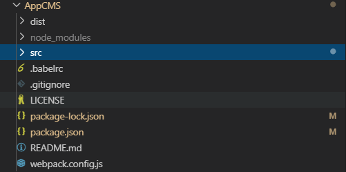

## Git 与 Github 的使用

#### 本地Git同步至Github

> 在VS Code中使用 
> 需要在本地首先配置全局git 
```
git -l 查看全局配置
git config --global user.name "an..."
git config --global user.email "220......@qq.com" //设置github 提交用户
```



1. 需要新增 .gitignore ,LICENSE ,README.md 三个文件；
   1. gitignore  不需要加入版本管理的文件 或者 文件夹

      > node_modules
      >
      > .idea
      >
      > .vscode
      >
      > .git

   2. LICENSE  开源协议

   3. README 项目介绍

2. 初始化项目 ，创建git本地库 以及提交到github中；

   1. 创建github账号，并创建代码库（注意 一定不要选择LICENSE  和 README防止无法提交 ）

   2. 在VSCode中创建项目，并：

      ```
      1. git init    //在项目根目录初始化 git
      2. git status  //查看项目文件同步状态
      3. git add .   //将待同步文件提交到本地库 的配置文件中
      4. git commit -m "description"  //将待同步文件提交至本地库
      5. git remote add origin https://github.com/anekosg/VantLPro.git   //映射本地库至github 
      6. --git remote delate //重新映射远程代码库
      7. git push -u origin master  //同步本地库至 github中；
      8. -- git push  以后就可以使用这种简单方式提交代码
      // git push 推送至github 
      // git pull 从github同步至本地库
      ```

   3. 其中 3,4,8 属于日常提交
#### Github代码库clone至本地
1. 首先登录Github账号，创建库
> 其中.gitignore(排除指定文件或者文件夹版本管理),README(description)和LICENSE(开源协议)等根据需要自行选择；

1. 在本地新增文件夹，并命令行cd到新增文件夹目录中；
2. 初始化项目 ，创建git本地库 以及提交到github中；
```
git init //初始化git 库
git remote add origin https://github.com/anekosg/FrontInterview.git   //更新git库连接
git pull -u origin master 使用pull获取库,提交代码使用push；
git pull //以后只用pull 拉取就好
```