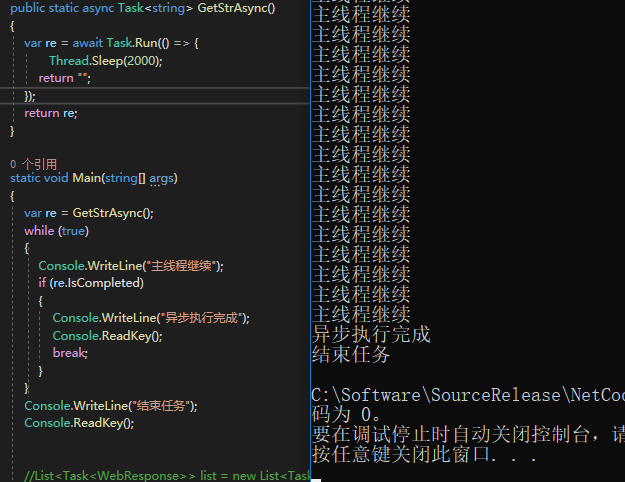

##### 异步 Async 和 await
```
        public static async Task<string> GetStrAsync()
        {
            var re = await Task.Run(() => {
                   Thread.Sleep(2000);
                return "";
            });
            return re;
        }

        static void Main(string[] args)
        {
            var re = GetStrAsync();
            while (true)
            {
                Console.WriteLine("主线程继续");
                if (re.IsCompleted)
                {
                    Console.WriteLine("异步执行完成");
                    Console.ReadKey();
                    break;
                }
            }
            Console.WriteLine("结束任务");
            Console.ReadKey();
        }
```


##### HTTP请求
```
        /// <summary>
        /// 泛型post请求（HttpWebRequest）
        /// </summary>
        /// <typeparam name="T">请求参数类型</typeparam>
        /// <typeparam name="R">返回参数类型</typeparam>
        /// <param name="baseUrl">请求URL</param>
        /// <param name="dictParam">请求参数</param>
        /// <returns>返回参数</returns>
        public static R ExecApiHttpPost<T, R>(string baseUrl, T dictParam)
            where T : class, new()
            where R : class, new()
        {
            R rInfo = new R();
            try
            {
                
                byte[] byteRequest = System.Text.Encoding.UTF8.GetBytes(JsonConvert.SerializeObject(dictParam));
                HttpWebRequest httpWebRequest;
                HttpWebResponse webResponse;
                Stream getStream;
                

                httpWebRequest = (HttpWebRequest)HttpWebRequest.Create(baseUrl);
                httpWebRequest.ContentType = "application/json";
                httpWebRequest.Method = "POST";
                httpWebRequest.ContentLength = byteRequest.Length;
                using (Stream reqStream = httpWebRequest.GetRequestStream())
                {
                    reqStream.Write(byteRequest, 0, byteRequest.Length);
                }
                //多余开启线程
                webResponse = (HttpWebResponse)httpWebRequest.GetResponseAsync().Result;
                getStream = webResponse.GetResponseStream();
                using (StreamReader stream = new StreamReader(getStream, Encoding.UTF8))
                {
                    string result = stream.ReadToEnd();
                    if (!string.IsNullOrEmpty(result))
                    {
                        rInfo = JsonConvert.DeserializeObject<R>(result);
                    }
                }
            }
            catch (Exception ex)
            {
                // 无需处理
            }
            return rInfo;
        }
```