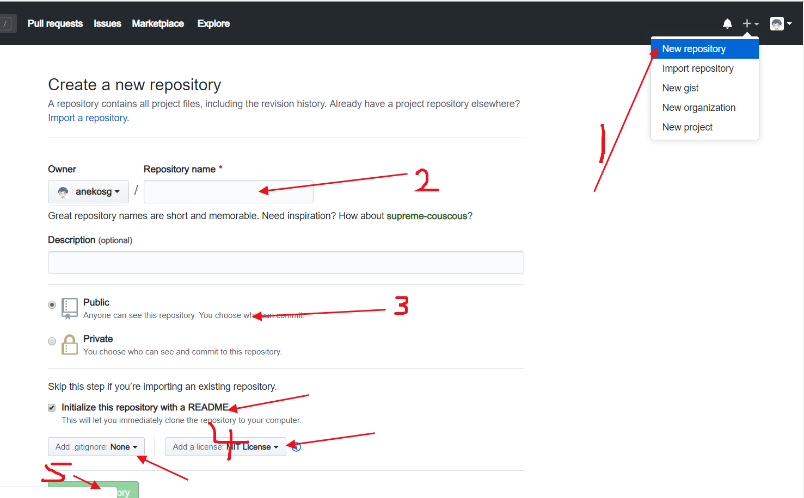

##### 异步 Async 和 await
```
        public static async Task<string> GetStrAsync()
        {
            var re = await Task.Run(() => {
                   Thread.Sleep(2000);
                return "";
            });
            return re;
        }

        static void Main(string[] args)
        {
            var re = GetStrAsync();
            while (true)
            {
                Console.WriteLine("主线程继续");
                if (re.IsCompleted)
                {
                    Console.WriteLine("异步执行完成");
                    Console.ReadKey();
                    break;
                }
            }
            Console.WriteLine("结束任务");
            Console.ReadKey();
        }
```

