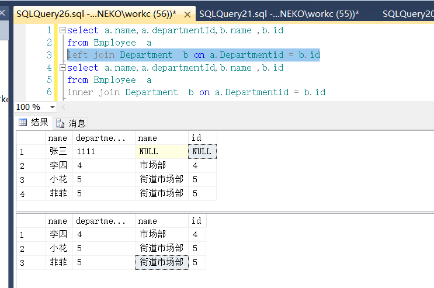

##### 异步 Async 和 await
```
        public static async Task<string> GetStrAsync()
        {
            var re = await Task.Run(() => {
                   Thread.Sleep(2000);
                return "";
            });
            return re;
        }

        static void Main(string[] args)
        {
            var re = GetStrAsync();
            while (true)
            {
                Console.WriteLine("主线程继续");
                if (re.IsCompleted)
                {
                    Console.WriteLine("异步执行完成");
                    Console.ReadKey();
                    break;
                }
            }
            Console.WriteLine("结束任务");
            Console.ReadKey();
        }
```


##### HTTP请求
```
        /// <summary>
        /// 泛型post请求（HttpWebRequest）
        /// </summary>
        /// <typeparam name="T">请求参数类型</typeparam>
        /// <typeparam name="R">返回参数类型</typeparam>
        /// <param name="baseUrl">请求URL</param>
        /// <param name="dictParam">请求参数</param>
        /// <returns>返回参数</returns>
        public static R ExecApiHttpPost<T, R>(string baseUrl, T dictParam)
            where T : class, new()
            where R : class, new()
        {
            R rInfo = new R();
            try
            {
                
                byte[] byteRequest = System.Text.Encoding.UTF8.GetBytes(JsonConvert.SerializeObject(dictParam));
                HttpWebRequest httpWebRequest;
                HttpWebResponse webResponse;
                Stream getStream;
                

                httpWebRequest = (HttpWebRequest)HttpWebRequest.Create(baseUrl);
                httpWebRequest.ContentType = "application/json";
                httpWebRequest.Method = "POST";
                httpWebRequest.ContentLength = byteRequest.Length;
                using (Stream reqStream = httpWebRequest.GetRequestStream())
                {
                    reqStream.Write(byteRequest, 0, byteRequest.Length);
                }
                //多余开启线程
                webResponse = (HttpWebResponse)httpWebRequest.GetResponseAsync().Result;
                getStream = webResponse.GetResponseStream();
                using (StreamReader stream = new StreamReader(getStream, Encoding.UTF8))
                {
                    string result = stream.ReadToEnd();
                    if (!string.IsNullOrEmpty(result))
                    {
                        rInfo = JsonConvert.DeserializeObject<R>(result);
                    }
                }
            }
            catch (Exception ex)
            {
                // 无需处理
            }
            return rInfo;
        }
```
##### Linq to sql 之 left与inner join的使用方法

生成测试数据
```
//创建测试表
CREATE TABLE Employee
(
id int identity(1,1),
name nvarchar(10),
age int,
sex int,
remark text,
createTime datetime,
updateTime datetime
)

CREATE TABLE Department
(
id int identity(1,1),
name nvarchar(10),
parentId int,
remark text,
createTime datetime,
updateTime datetime
)
//插入测试数据
insert into Employee (name,age,sex,departmentId,remark,createTime,updateTime) 
select '张三',8,1,1111,null,'2020-02-20 00:00:00.000','2020-02-20 00:00:00.000' union  all
select '李四',8,1,4,null,'2020-02-20 00:00:00.000','2020-02-20 00:00:00.000'union  all
select '小花',8,1,5,null,'2020-02-20 00:00:00.000','2020-02-20 00:00:00.000'union  all
select '菲菲',8,1,5,null,'2020-02-20 00:00:00.000','2020-02-20 00:00:00.000'
insert into Department (name,parentId,createTime,updateTime) 
select '技术部',null,'2020-02-20 00:00:00.000','2020-02-20 00:00:00.000' union  all
select 'ERP部',1,'2020-02-20 00:00:00.000','2020-02-20 00:00:00.000'union  all
select 'EPM部',1,'2020-02-20 00:00:00.000','2020-02-20 00:00:00.000'union  all
select '市场部',null,'2020-02-20 00:00:00.000','2020-02-20 00:00:00.000'union  all
select '街道市场部',4,'2020-02-20 00:00:00.000','2020-02-20 00:00:00.000' union  all
select '城区大部',4,'2020-02-20 00:00:00.000','2020-02-20 00:00:00.000'union  all
select '天门街道部',5,'2020-02-20 00:00:00.000','2020-02-20 00:00:00.000'union  all
select '露水街道部',5,'2020-02-20 00:00:00.000','2020-02-20 00:00:00.000'
```
测试
```
//sql
select a.name,a.departmentId,b.name ,b.id
from Employee  a
left join Department  b on a.Departmentid = b.id
select a.name,a.departmentId,b.name ,b.id
from Employee  a 
inner join Department  b on a.Departmentid = b.id

//linq to sql
 using (var dbContext = new DBEFDataContext())
            {
                var lsit = dbContext.Employee.ToList();
                foreach (var item in lsit)
                {
                    Console.WriteLine(string.Format("id:{0};name:{1}", item.id, item.name));
                }

                var re = (from a in dbContext.Employee
                          join b in dbContext.Department on a.departmentId equals b.id
                          select new
                          {
                              name = a.name,
                              departmentName = b.name
                          }).ToList();
                foreach (var item in re)
                {
                    Console.WriteLine(string.Format("name:{0};departmentName:{1}", item.name, item.departmentName));
                }

                var re2 = (from a in dbContext.Employee
                          join b in dbContext.Department on a.departmentId equals b.id into result
                          from gg in result.DefaultIfEmpty()
                          select new
                          {
                              name = a.name,
                              departmentName = gg == null ?"":gg.name
                          }).ToList();
                foreach (var item in re2)
                {
                    Console.WriteLine(string.Format("name:{0};departmentName:{1}", item.name, item.departmentName));
                }
            }
```


