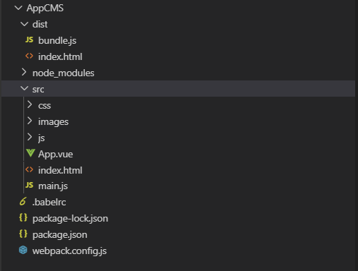
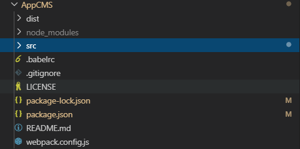

## Vue 和 Webpack 使用指南
#### 项目创建
##### 项目根目录


```
root
	src	
		css
		js
		images
		index.html
		main.js
		App.vue
	dist
```

#### 项目运行

##### 项目打包

1. 安装Node.js 同时会自动安装NPM包管理器

2. 在命令行中运行````npm i webpack -g```` 全局安装webpack；

3. 在项目根目录命令行中运行 ``` npm i webpack -s-d``` 安装到项目依赖中；执行操作后会自动在项目根目录中添加package-lock.json 文件； （-s：生产环境 -d :开发环境 -g:全局安装）

4. 在项目根目录命令行中运行````npm init```` 初始化项目；执行操作后会自动在项目根目录中添加package.json 文件；

5. 打包 文件

   - 一般打包
     - 在项目根目录命令行中运行 ```webpack src/main.js -o dist/bundle.js```  将打包好的文件放在指定目录； 其中 -o 是webpack新版本的写法；
     - 运行```cnpm i  webpack-cli -g-s-d``` 安装webpack运行时才可以执行；

   - 推荐打包，自动捕获更新打包

     1. 在项目根目录中创建`webpack.config.js` 配置以下内容：

     ```
       // 导入 nodejs 的path地址模块
     const path =require('path');
      // 导入自动生成HTMl文件的插件
      var htmlWebpackPlugin = require('html-webpack-plugin');
     //引入这行 ,必须加 识别 vue组件
      const VueLoaderPlugin = require('vue-loader/lib/plugin'); 
     
     module.exports={
         mode: 'development', //production 生产 如果不配置则无法生成 bundle.js文件
         watch: true, //监听main.js 改变后自动打包
         entry:path.join(__dirname,'./src/main.js'), //打包入口
         output:{ //打包输出地址和输出文件名称
             path:path.join(__dirname,'./dist'),
             filename:'bundle.js'
         },
         plugins:[ // 添加plugins节点配置插件
             new htmlWebpackPlugin({ //在动生成Html
                 template:path.resolve(__dirname, './src/index.html'),//模板路径
                 filename:'index.html'//自动生成的HTML文件的名称
             }),
             new VueLoaderPlugin() //new一个实例，渲染Vue组件
         ],
         module:{
              rules: [ // 文件的匹配规则
                 { test: /.css$/, use: ['style-loader', 'css-loader'] },//处理css文件的规则
                 { test: /\.scss$/, use: ['style-loader', 'css-loader', 'sass-loader'] },
                 { test: /\.less$/, use: ['style-loader', 'css-loader', 'less-loader'] },
               //  { test: /\.(png|jpg|gif)$/, use: 'url-loader' }, //处理css路径
                 { test: /\.(png|jpg|gif)$/, use: 'url-loader?limit=43960' }, //处理指定大于指定字节的图片进行base64编码；
             ]
         },
         resolve:{
             alias: { //别名
                 "vue$":"vue/dist/vue.js" //导入Vue时，默认导入的是精简包，这里更新为完整包
             }
         }
     };
     ```

     2. 使用``` npm i webpack-dev-server -s-d``` 插件捕获代码更新 来实现代码实时打包编译；
     3. 使用 `npm run dev`命令打包时，需要在`package.json `文件 `script` 节点下新增指令；其中`webpack-dev-server`会将打包好的Bundle.js文件放到内存中，不会输出到dist目录下；所以访问时需要更新index.html 的script 标签手动链接```../bundle.js```

     ```
     {
       "name": "appcms",
       "version": "1.0.0",
       "description": "",
       "main": "index.js",
       "dependencies": {
         "babel-plugin-import": "^1.12.2",
         "css-loader": "^3.2.0",
         "html-webpack-plugin": "^3.2.0",
         "mint-ui": "^2.2.13",
         "style-loader": "^1.0.0",
         "vant": "^2.2.9",
         "vue": "^2.6.10",
         "vue-loader": "^15.7.1",
         "vue-router": "^3.1.3",
         "vue-template-compiler": "^2.6.10",
         "webpack": "^4.41.2",
         "webpack-cli": "^3.3.9",
         "webpack-dev-server": "^3.8.2"
       },
       "devDependencies": {},
       "scripts": {
         "test": "echo \"Error: no test specified\" && exit 1",
         "dev": "webpack-dev-server --open --port 3000 --contentBase src --hot" //此处为新增指令； open为自动打开 port端口号 contentBase src设置主页 --hot热启动
       },
       "author": "",
       "license": "ISC"
     }
     
     ```

     4. 使用插件````npm i html-webpack-plugin -s-d```` 设置启动页，并且自动链接script标签； 并且需要修改webpack.config.js配置文件；（配置文件已加入）
##### 项目各种文件类型打包

###### CSS文件

1. 运行scss 
2. 
   1. ```npm i sass-loader node-sass -s-d```  sass文件
   2. `npm i style-loader css-loader -s-d` css文件
   3. `npm i url-loader file-loader -s-d` css路径
   4. ```npm i less-loader less -s-d``` less文件
3. 修改`webpack.config.js`这个配置文件;(配置文件已加入)


## ES6 与 node.js

####  导出或导入成员

###### 导出成员

```
node 方式
module.exports = {}
ES6方式
var info={}
1. export default info
2. export var title = '小星星' 
```

###### 导入成员

```
node方式
var 名称 = require('模块标识符')
ES6方式
1. import 模块名称 from '模块标识符'    ，import '表示路径'
2. import {name，name2} from '模块标识符'
```

## Git 与 Github 的使用

#### 本地Git同步至Github

> 在VS Code中使用



1. 需要新增 .gitignore ,LICENSE ,README.md 三个文件；
   1. gitignore  不需要加入版本管理的文件 或者 文件夹

      > node_modules
      >
      > .idea
      >
      > .vscode
      >
      > .git

   2. LICENSE  开源协议

   3. README 项目介绍

2. 初始化项目 ，创建git本地库 以及提交到github中；

   1. 创建github账号，并创建代码库（注意 一定不要选择LICENSE  和 README防止无法提交 ）

   2. 在VSCode中创建项目，并：

      ```
      1. git init    //在项目根目录初始化 git
      2. git status  //查看项目文件同步状态
      3. git add .   //将待同步文件提交到本地库 的配置文件中
      4. git commit -m "description"  //将待同步文件提交至本地库
      5. git remote add origin https://github.com/anekosg/VantLPro.git   //映射本地库至github 
      6. --git remote delate //重新映射远程代码库
      7. git push -u origin master  //同步本地库至 github中；
      8. -- git push  以后就可以使用这种简单方式提交代码
      // git push 推送至github 
      // git pull 从github同步至本地库
      ```

   3. 其中 3,4,8 属于日常提交
#### Github代码库clone至本地

1. 待写